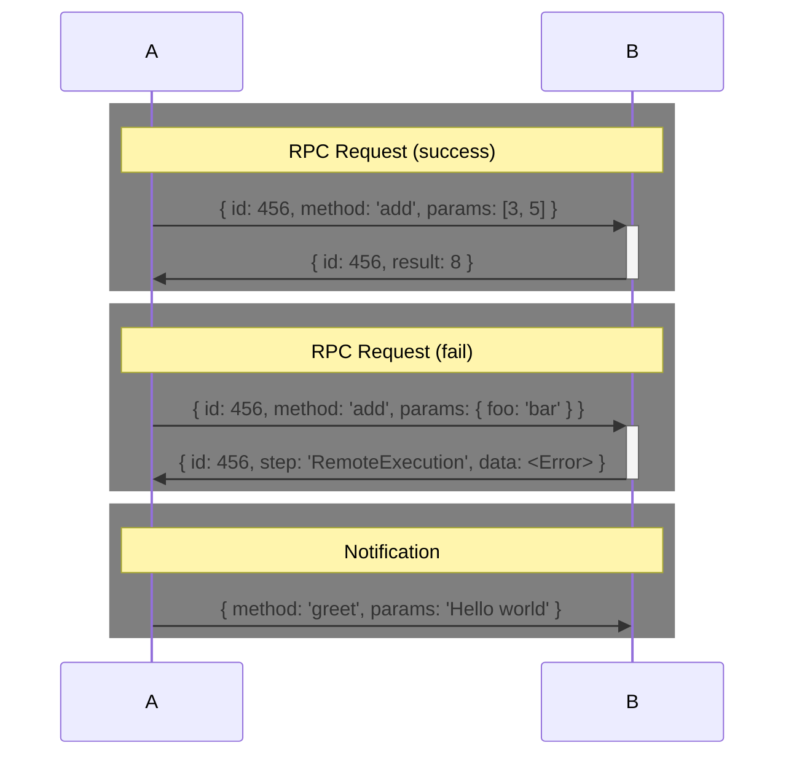
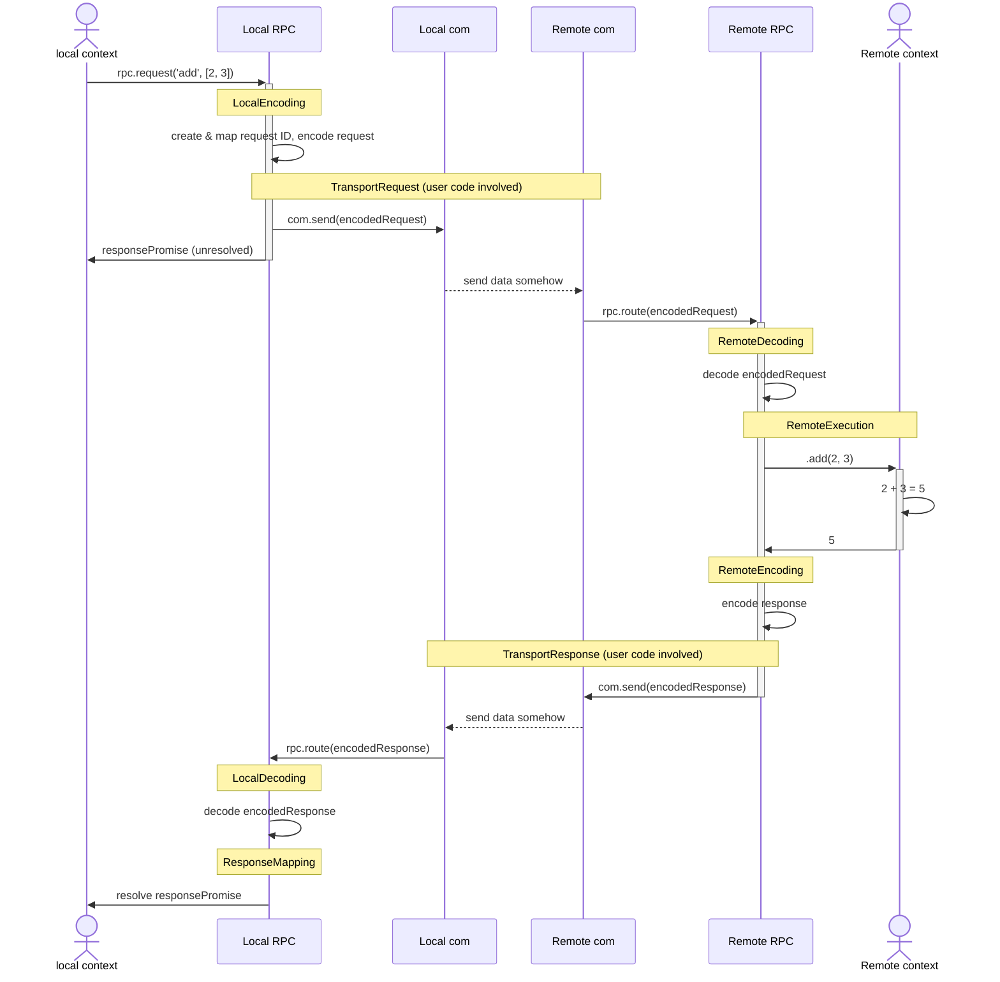

# RPC Async

Builds RPC context on top of a loosely coupled communication protocols.

Inspired by [dnode](https://www.npmjs.com/package/dnode), [jayson](https://www.npmjs.com/package/jayson), [jsonrpc](https://www.jsonrpc.org/specification) and manny more.

Features

* Bidirectional async RPC (as long as the base communication is bidirectional)
* custom message encoding
* NodeJS / Browser support
* Streaming

## Usage

### Inter process communication
`ipc-parent.js`
```js
import RPC from 'rpc-async'
```


## Protocol

### Message serialisation

This RPC protocol defines 4 different message types.

| Message type | Purpose
|---|---
| Notification | One way message without response
| Request | RPC request that expects the remote peer to respond with an answer
| Response | RPC response from remote peer in case of success
| Error | RCP error from the remote peer in case of failure


### Transport serialisation format (JSON example)



### RPC sub-steps


| Step | Description
|---|---
| LocalEncoding | RPC serialises the request for transport
| TransportRequest | request message is sent via communication layer
| RemoteDecoding | request message is parsed by the remote peer
| RemoteExecution | remote peer executes the requested procedure
| RemoteEncoding | remote peer serialises its response for transport
| TransportResponse | response message is sent via communication layer
| LocalDecoding | RPC decodes the received response message
| ResponseMapping | RPC resolves the promise associated with the response

RpcEx
In case of a cought exception during an RPC, the response message uses its *origin* property to reference the step in the protocol sequence that caused it.

